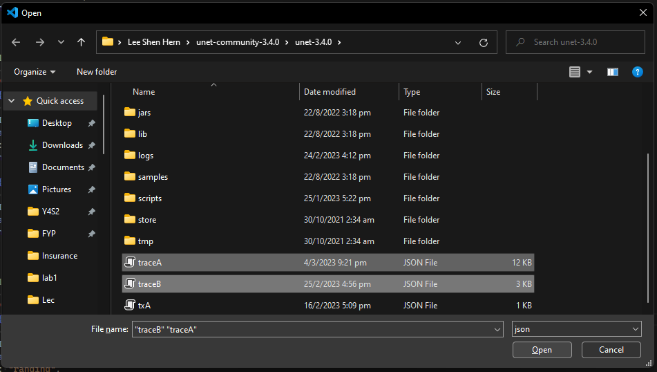
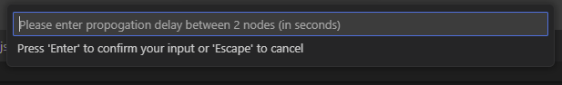
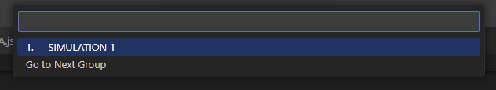
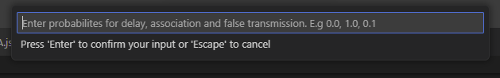
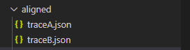
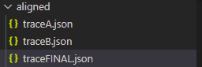

# UnetTrace Plugin README

VScode plugin to visualise messages being sent to and from different agents and layers in UnetStack.

## Features

User will be able to select a trace.json file. The events in the trace file will be displayed in a graph/diagram that is interactive and displays relevant information about each message transfer (e.g. sending agent, receiving agent, messageID, etc).

## Requirements

Please refer to https://code.visualstudio.com/api on how to setup the work environment for building VSC extensions.

Briefly put, the following are required:
- node.js
- Git
- VS Code Extension Generator (yo code)

## Extension Settings

Include if your extension adds any VS Code settings through the `contributes.configuration` extension point.

This extension contributes the following settings:
* `unettrace.solve`: Allows user to choose 2 individual trace.json files and align their timings for clock drift.

* `unettrace.combine`: Allows user to combine the aligned trace.json files; also includes insertion of halfduplexmodem events within the combined trace.json file.

* `unettrace.trace`: Allows user to choose a trace.json file that is used for visualisation of message transfers.

## Known Issues

Calling out known issues can help limit users opening duplicate issues against your extension.

## Release Notes

Users appreciate release notes as you update your extension.

### 1.0.0

Initial release of ...

### 1.0.1

Fixed issue #.

### 1.1.0

Added features X, Y, and Z.

---

## Following extension guidelines

Ensure that you've read through the extensions guidelines and follow the best practices for creating your extension.

* [Extension Guidelines](https://code.visualstudio.com/api/references/extension-guidelines)

## Working with Markdown

You can author your README using Visual Studio Code. Here are some useful editor keyboard shortcuts:

* Split the editor (`Cmd+\` on macOS or `Ctrl+\` on Windows and Linux).
* Toggle preview (`Shift+Cmd+V` on macOS or `Shift+Ctrl+V` on Windows and Linux).
* Press `Ctrl+Space` (Windows, Linux, macOS) to see a list of Markdown snippets.

## For more information

* [Visual Studio Code's Markdown Support](http://code.visualstudio.com/docs/languages/markdown)
* [Markdown Syntax Reference](https://help.github.com/articles/markdown-basics/)

**Enjoy!**

# User Guide
To generate a `trace.json` file fit for visiualization, there are 2 steps that need to be taken.
##  "UnetTrace: Align trace.json Timings of 2 Nodes"
- Press `CTRL + SHIFT + P` to open up the command palette and search for "UnetTrace: Align trace.json Timings of 2 Nodes"

- A popup window will appear; go ahead and select the two trace files for alignment

- Then enter the propogation delay in **SECONDS** between the two nodes into the prompt window

- Choose the simulation/experiment group to be used from the prompt window for each node

- Enter the probabilites for delay, association, and false transmission respectively. They will be used for matching TX and RX events.

- A folder called `aligned/` will be created; the aligned trace files are stored here.

## "UnetTrace: Combine Aligned trace.json Files"
- Press `CTRL + SHIFT + P` to open up the command palette and search for "UnetTrace: Combine Aligned trace.json Files"

- The individual trace files in `aligned/` are merged and halfduplexmodem events inserted for TX/RX events.

- The resulting trace file is saved as `aligned/traceFINAL.json`

