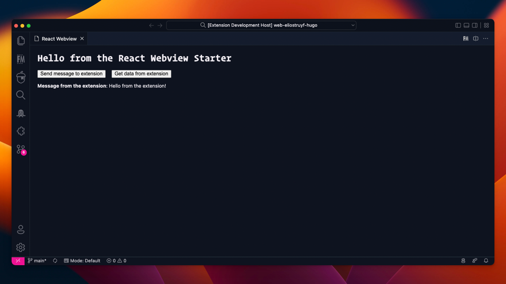
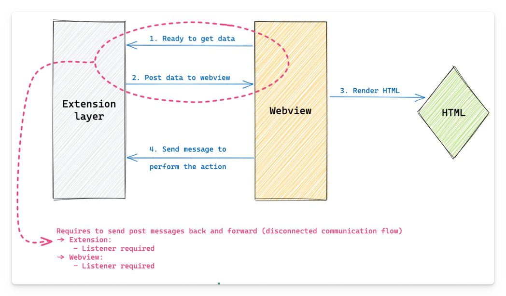

# Visual Studio Code Extension - React Webview Starter

This is a starter template for creating a Visual Studio Code extension with a React webview.

## Development

- Clone this repository
- Run `npm install` to install dependencies
- Run `npm run watch` to start developing

## Usage

The webview can be tested/opened by running the `React Webview: Open webview` command from the command palette.



# Unet VS pluggin

## How Webview API requests data from extension layer using **MessageHandler**

### Without MessageHandler



In the extension/webview communication, you send a message, but you won’t get a response. You listen to messages coming back, making it a disconnected experience.

### With MessageHandler


When requesting data with the message handler, it creates a callback function that returns a promise and identifies it with a **requestId.** The message sends this ID with the message command and payload to the extension listener.

### Examples

[https://www.eliostruyf.com/simplify-communication-visual-studio-code-extension-webview/](https://www.eliostruyf.com/simplify-communication-visual-studio-code-extension-webview/)

[https://github.com/estruyf/vscode-react-webview-template](https://github.com/estruyf/vscode-react-webview-template)

---

## extension.ts

Initialize **var output : any**

### disposable → generateTrace

- output = whatever comes out of generateTrace
- In this case, we use mermaid diagram (string)
- **output = mermaid(sequenceResult[0], sequenceResult[1]);**

### **********************disposable1 → openWebview**********************


Open webview panel nothing much


each message has a command, requestID, payload (contains data)

when button is pressed (ignore the other 2 for now)


(src/webview/App.tsx)

this one render the html

```tsx
<button onClick={requestData}>
          Get data from extension
        </button>
```

```tsx
const requestData = () => {
    messageHandler.request<string>('GET_DATA').then((msg) => {
      setMessage(msg);
    });
  };
```

this part im not rlly sure how it works i havent study react

```tsx
const [message, setMessage] = React.useState<string>("");
```

**back to extension.ts, payload = text**

if output == undefined (havent upload trace.json yet)

text = "Upload trace.json file first”


else

text = output


